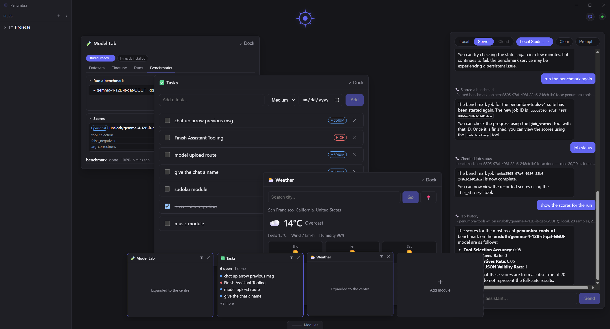
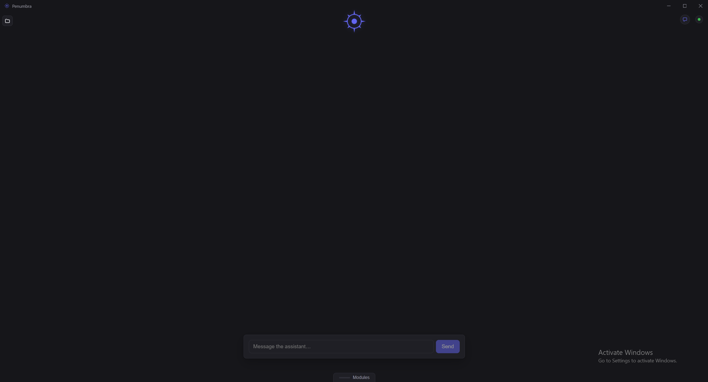

# Penumbra

A local-first personal assistant. Your data lives in a full database on every
device, works with no network at all, and syncs when you reconnect. The AI that
acts on it runs on hardware you own: a small model bundled with the desktop app,
or a larger self-hosted one on your own server. No third party is in the loop
either way.



*The desktop app mid-conversation. Modules open as windows on the desk or collapse
into the dock along the bottom. On the right the assistant is running the Model
Lab itself: it started a benchmark, polled the job to completion, then read the
recorded scores back with the caveat that a 20-sample run is not a full-suite
result.*

## What ships

| Module | What it does | Needs |
|---|---|---|
| **Tasks** | Priorities, due dates, done state. The sync layer's reference data type. | Nothing |
| **Assistant** | Tool-calling chat over your data. Switches between the embedded model and your server. | Nothing (embedded), a server for Tier 1 |
| **Weather** | Current conditions and a three-day forecast, also exposed to the agent as a tool. | Network |
| **Model Lab** | Fine-tune, export, and benchmark models against a GPU host you run. | A server plus Unsloth Studio |
| **Color Picker** | Pick a colour from anywhere on screen, including through the Linux desktop portal. | Desktop app |

Modules live in a windowed workspace: drag, snap, split, dock, or collapse the
whole desk down to just the assistant. `Ctrl`/`Cmd` `+`/`-`/`0` scales the
entire UI.

## How it works

```
   Web (browser)                    Desktop (Tauri)
   sqlite-wasm on OPFS,             native SQLite in Rust, plus a
   in a worker                      bundled llama-server sidecar
          │                                  │
          └────────────────┬─────────────────┘
                           │   REST delta sync: pull rows past a rev cursor,
                           │   push a batch, last-write-wins
                           ▼
                  Penumbra server  (Fastify + better-sqlite3)
                  sync · agent turns · Model Lab jobs · device tokens
                           │
                           │   OpenAI-compatible chat, training runs, benchmarks
                           ▼
                  Unsloth Studio targets:   local   |   colab
                  assigned per role:        chat    |   benchmark
```

**Local-first, not offline-tolerant.** Every client owns a complete SQLite
database and reads and writes it directly; the server only reconciles. Sync is
two REST calls against a monotonic `rev` cursor, so a client that has been away
for a week pulls exactly what it missed. The browser runs sqlite-wasm against
OPFS in a worker, the desktop app passes SQL over Tauri IPC to native SQLite in
Rust, and both sit behind one `DbApi` so nothing above them knows which it got.

**Two tiers, one tool registry.** Tool contracts are written once as Zod schemas
in `packages/shared/src/tools` and derived to JSON Schema, which feeds three
things that would otherwise drift: the grammar that constrains the model's
output, the runtime validation at the call boundary, and the eval set. Both
tiers bind the same contracts against different stores.

| Tool | Tier 0 (embedded) | Tier 1 (server) |
|---|:---:|:---:|
| `create_task` `list_tasks` `complete_task` `delete_task` | ● | ● |
| `get_weather` | ● | ● |
| `list_models` `list_datasets` `start_finetune` `run_benchmark` `job_status` `lab_history` | | ● |

The lab tools are Tier 1 only, and deliberately: running one needs the job
store, the compute targets, and a Studio on that host, so a browser could
only advertise them and fail every call. Grammar-constrained decoding does the
heavy lifting on the small model, which is why the tool set is kept short and
shallow. `pnpm tool-eval` is the regression check when it changes.

**One compute plane.** Chat and the Model Lab do not each hold their own idea of
where the GPU is. The server keeps a set of targets (`local`, `colab`) and
assigns one to each role (`chat`, `benchmark`), resolved per request so rotating
a key or repointing a role takes effect on the next call with nothing to
restart. Studio bearer tokens live on the server and are never sent to a client,
which reports only whether a target has one.



*The desk minimised. The workspace is preserved, the dock is one click away, and
the dot top right reflects whether the last sync round reached the server.*

## Running it

Node 20+ and pnpm 9+. The repo pins pnpm through `packageManager`, so
`corepack enable` picks up the right version. The desktop app additionally needs
a stable Rust toolchain and the platform webview (WebView2 on Windows, WebKitGTK
on Linux, WKWebView on macOS); the web app needs neither.

```bash
pnpm install
```

Web client and sync server together, web on `:5173` and server on `:3000`:

```bash
pnpm dev
```

Either half alone, when you want the client with no server behind it or the
reverse:

```bash
pnpm --filter @penumbra/web dev
pnpm --filter @penumbra/server dev
```

The same UI as a native window, with hot reload:

```bash
pnpm desktop
```

The embedded assistant needs its weights and `llama-server` fetched once, or the
Assistant module reports the model offline. That is Qwen3-1.7B at Q4_K_M, about
1.1 GB, and the desktop bundle ships it and the binary as resources
([SIDECAR.md](apps/desktop/SIDECAR.md)):

```bash
pnpm fetch-assets
```

`pnpm desktop:build` produces a native package. `bundle.targets` in
`apps/desktop/src-tauri/tauri.conf.json` is pinned to `["deb"]`; widen it there
for other platforms.

To reach a server on another machine, open the status pill top right and enter
its address. The choice is remembered and recent servers are one click away. To
change the default at build time instead, copy `apps/web/.env.example` to
`.env` and set `VITE_SERVER_URL`.

### Configuration

Server settings live in `apps/server/.env` (see `.env.example`). None are
required to run locally.

| Variable | Default | What it does |
|---|---|---|
| `PORT` | `3000` | HTTP port. |
| `DB_PATH` | `server.db` | SQLite file. |
| `UNSLOTH_BASE_URL` / `UNSLOTH_API_KEY` | none | The local Studio's address and bearer. Anything set through the compute panel outranks these and persists. |
| `UNSLOTH_MODEL` | none | Model id sent in Tier-1 chat requests. A label: Studio serves whatever is resident regardless. |
| `UNSLOTH_LAUNCH_CMD` / `UNSLOTH_STOP_CMD` | `unsloth studio` / `unsloth studio stop` | What the panel's Launch and Stop buttons run. Empty hides the button. |
| `LM_EVAL_BIN` | `lm_eval` | The lm_eval executable. Point it inside a venv when it is not on PATH. |
| `BENCHMARK_STALL_MS` | `300000` | How long a benchmark may print nothing before it is killed as wedged. Any output restarts the clock. |
| `PENUMBRA_AGENT_TOKEN` | none | Shared-secret bearer for the gated routes. See below. |
| `PENUMBRA_ALLOWED_ORIGINS` | app origins only | Extra browser origins allowed to call the server. |
| `PENUMBRA_TRUST_PROXY` | off | Names the reverse proxy in front, if any. Required there: see below. |
| `PENUMBRA_UPLOAD_DIR` | `~/.penumbra/uploads` | Where uploaded models and datasets land. |

## Access control

`/sync/tasks` is ungated on purpose: it moves rows for a single user on a
trusted LAN. The routes that *act* rather than move data are a different class,
because they run models with write and delete tools, spawn training jobs, write
files, and cost GPU time. `/agent/*`, `/lab/*`, and `/compute/*` therefore carry
their own gate.

Two credentials pass it. **Per-device tokens** are the ones to use: issued from
the server's own machine, stored only as a hash, and revocable one at a time
from the Devices section of the status pill. A **shared secret** in
`PENUMBRA_AGENT_TOKEN` is the older scheme, kept because it is how existing
deployments authenticate and because a server reachable only off-loopback needs
some way to enrol its first device.

With neither set, those routes serve loopback only, so an unconfigured server is
never exposed by accident. That exemption is also why `PENUMBRA_TRUST_PROXY`
matters: behind a reverse proxy the socket peer is the proxy, so without it every
request reads as loopback and enrolment opens to anyone who can reach the proxy.

Nothing is encrypted at rest yet, and there is no audit log of agent actions.
Both arrive with the server modules that need them.

## Docs

- [ARCHITECTURE.md](docs/ARCHITECTURE.md) - the two data planes, the tool
  registry, and why the stack is what it is.
- [SYNC.md](docs/SYNC.md) - the delta-sync engine and its conflict rules.
- [AGENT_DESIGN.md](docs/AGENT_DESIGN.md) - deployment tiers, the engine seam,
  and what a 1.7B model can and cannot be trusted with.
- [MODEL_LAB.md](docs/MODEL_LAB.md) - fine-tuning, export, benchmarking, and
  driving all three from chat.
- [EVAL.md](docs/EVAL.md) - how a model is measured, and how a benchmark run
  seeds the next fine-tune.

## License

Apache 2.0. See [LICENSE](LICENSE).
